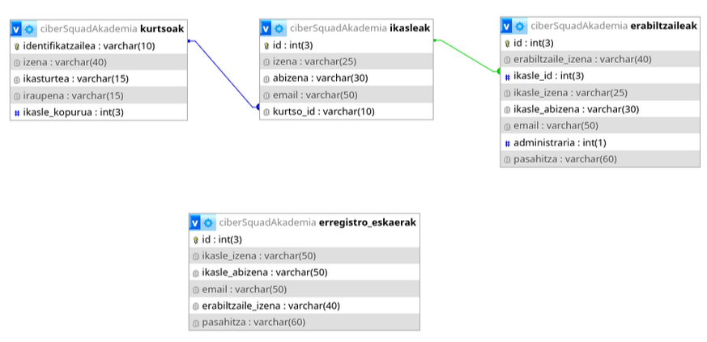
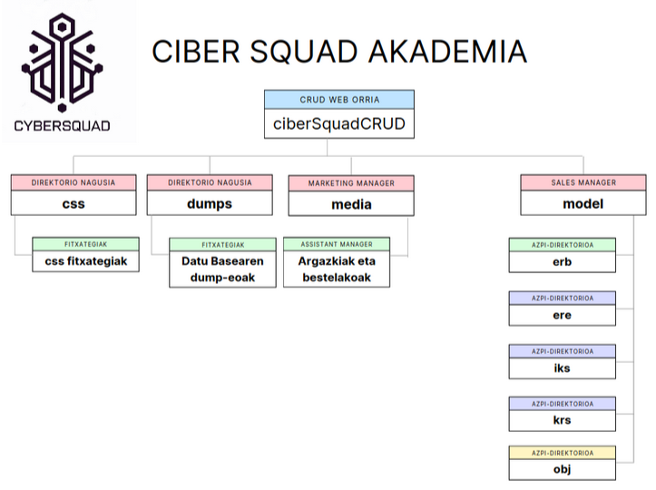

# ciberSquadCRUD

## 1. Datu Basea

Erronka honetarako CRUD motatako web orrialde bat sortu dugu. Orri horren bitartez datuak atzitu, bistaratu eta prozesatu ahalko dugu. Orriak informazio sistemaren muina da erabiltzaileak zuzenean interakzioak eramaten dutelako aurrera. Interakzio horren emaitz moduan prozesatutako datuak aurkituko lirateke. Datu horiek zerbitzari batean dugun datu basean biltzen ditugu.

CRUD bat egiterakoan, garrantzitsua da datu-basearen barruan erabiliko diren taulak eta horien arteko erlazioak zehaztea.

Gure kasuan 4 taula ditugu, lehenengoak Kurtsoak du izena eta giltza nagusia Identifikatzailea da. Bigarrenak Ikasleak du izena, bere giltza nagusia ID da, eta kurtsoak taularekin elkartzen da kurtso_id eremuaren bidez. Hirugarren taula Erabiltzaileak du izena, taularen giltza nagusia ID da, eta ikasle_id eremuaren bidez juntatzen da Ikasleak taularekin. Gainera ikasleen taulan bakoitza matrikulatu den kurtsoaren identifikatzailea batzen dugu ere, kurtso_id-a kurtsoen taulako identifikatzailea izanik.

Azkenik, beste taula bat dugu, eskatutako erregistroen eskaerak gordetzeko. Taula honek lehen instantzia moduan sartzen diren erabiltzaileak zuzenean ez erregistratzea ahaldibetzen digu. Web orriaren administrariak izango du alta emateko ahalmena, horregatik erabiltzaile berri bat web orriaren bitartez erregistro eskaera bat egingo du eta geroago administrariak alta emango dio ikasleetan eta erabiltzaileetan. Erregistro_eskaerak taulak pertsonaren datuak, erabiltzaile izena etab batzen ditu, eta datu horien bitartez alta prozesatzen da.

Honak hau izango litzateke datu basearen diagrama. Bertan eremuen izenak eta taulen arteko erlazioak ikusi ahal dira:

## 2. CRUD web orria (nondik norakoak)

Behin hori zehaztuta, CRUD orrialdea azaltzera pasako gara. Kasu zehatz honetan web orria HTML, CSS eta PHP lengoaiekin garatu dugu. HTML eta CSS markatze lengoaiak frontend-aren garapenean erabili ditugu non erabiltzailearentzat ahalik eta interfaze ulergarri eta garbiena lortzen saiatu garen. PHP-ren bitartez datuen prozesamendua eta datu basera atzipena eraman dugu aurrera.

Nahiz eta ez dagoen guztiz MVC (Model-View-Controller) eredua zorrotz jarraitzen duen egitura batean, webgune hau MVCren printzipio batzuk betetzen ditu, HTML, CSS, eta PHP erabiliz:

- Models (Ereduak): MVC ereduan, ereduak datuen kudeaketarekin eta datu-basearekin komunikazioarekin lotuta daude. Kasu honetan, Ikaslea, Erabiltzailea eta Kurtsoa bezalako ereduak sortu dira, objektu-orientazioa erabiliz. Eredu hauek datuak eta datu-basearekiko interakzioak bideratzen dituzte, adibidez, erabiltzaileen datuak kargatu eta gordetzeko edo kurtsoen informazioa eskuratzeko. Eredu hauei esker, datu-kudeaketa errazagoa eta argiagoa bihurtzen da.
  
- Views (Bistak): Webguneko HTML dokumentuak eta CSS estilo-fitxategiak erabiltzaileari erakusten dioten informazioa eta interfazea osatzen dute. HTML fitxategiek datuak bistaratu eta erabiltzaile-interakzioa ahalbidetzen dute, esaterako, kurtsoen zerrenda edo saioa hasteko formularioa. Erabiltzaileari erakusteko informazioa jaso ondoren, bistak interfazea era erakargarri batean aurkezten dute.
  
- Controllers (Kontroladoreak): PHP fitxategiek erabiltzaileen ekintzak prozesatzen dituzte, esaterako, saioa hasteko eskaerak, datu-basearekin elkarreragiteko kontsultak, eta matrikulazio-prozesuak. Fitxategi hauek erabiltzailearen eskaerak jaso eta horien arabera erantzuten dute, normalean datuak prestatuz eta bistetara igorriz. Saioa hastea edo datuak eguneratzea bezalako ekintzak kontrolatzaileek kudeatzen dituzte.

### 2.1. Webgunearen Egitura:

Webgunea PHPn garatuta dago, eta MySQL datu-base bat erabiltzen du erabiltzaileen eta kurtsoen informazioa gordetzeko. Webgunearen egitura orrialde nagusi eta osagarrien bidez antolatuta dago:

- saioa_hasi.php: Erabiltzaileek saioa hasteko formularioa. Erabiltzailea eta pasahitza sartzen ditu, eta autentifikazioa burutzen du.
- erregistratu.php: Erabiltzaile berriak erregistratzeko orrialdea. Beharrezko informazioa (erabiltzaile izena, pasahitza, eta abar) biltzen du.
- index_ikasleak.php: Saioa hasitako erabiltzaileek (ikasleek) ikus ditzaketen kurtsoen zerrenda erakusten duen orrialdea. Erabiltzaileek kurtsoetan matrikulatu daitezke orrialde honen bidez.
- matrikulazioa.php: Kurtso batean matrikulazio-eskaerak prozesatzen dituen orrialdea. Ikaslearen IDa eta kurtsoaren IDa jasotzen ditu, eta dagokion datu-base erregistroa eguneratzen du.

### 2.2. Teknologiak:

- Backend: PHP erabiltzen da zerbitzarian exekutatzeko, eta datu-basearekiko konexioak eta logika orokorra kudeatzeko.
- Datu-basea: MySQL datu-basea erabiltzen da erabiltzaile, kurtso eta matrikulen informazioa gordetzeko.
- Frontend: HTML eta CSS erabiltzen dira orrialdeak eraikitzeko eta estiloak aplikatzeko.
- Formularioen kudeaketa: Formularioak erabiltzaileek datuak sartu eta bidaltzeko mekanismo nagusia dira. PHPn egindako prozesamenduarekin integratzen dira.

### 2.3. Segurtasun Neurriak:

- Saio-kudeaketa (Session Management): session_start() funtzioa erabiltzen da erabiltzaileek saio aktiboa dutela egiaztatzeko. Erabiltzaile bakoitza saioa hasi duen edo ez egiaztatzen da, eta baimenak egiaztatzen dira, administratzailea den edo ikaslea den jakiteko.
- Pasahitzak Hasheatzea: Erabiltzaileek erregistratzen dituzten pasahitzak password_hash() funtzioarekin zifratu behar dira, eta saioa hasteko erabiltzen denean, password_verify() erabiltzen da. Honek datu-basean gordetako pasahitzak seguru mantentzen ditu.
- SQL Injizioaren Aurkako Babesa: SQL injekzioak saihesteko, prepare() eta bind_param() funtzioak erabiltzen dira SQL kontsultetan. Horrela, erabiltzaileek sartzen duten datuak zuzenean kontsultetan txertatzea saihesten da.
- Datu-sarreren balidazioa: Erabiltzaileen sarrera guztia balidatu egiten da, bai zerbitzarian (PHP) zein bezeroan (HTML) erroreak eta erasoak saihesteko.
- Baimen-kontrola: Erabiltzaileak baimen bereziak dituzten orrialdeetara sartzen saiatzen direnean, saioaren informazioa egiaztatzen da. Adibidez, administratzailea ez bada, erabiltzailea ezin da sartzeko baimena duen orrialde batera joan, eta saioa_hasi.php orrira bideratzen da.

### 2.4. Informazio Gehigarria:

- Erabiltzaile motak: Bi erabiltzaile mota daude: administratzaileak eta ikasleak. Administratzaileek kontrol handiagoa dute (adibidez, kurtsoak sortzea eta ikasleen kudeaketa), eta ikasleek matrikulatu eta ikusi ditzaketen kurtsoak dituzte eskuragarri.
- Responsive diseinua: Webgunea diseinu erantzunkorra du, hainbat gailutan ondo ikusteko moduan. HTML eta CSS estiloak erabiltzen dira pantailaren tamainara egokitzeko.
- Errore-mezuak eta bideratzea: Erroreak gertatzen direnean (adibidez, datu-basearekin konektatzerakoan), erabiltzailea zuzenean orrialde jakin batera bideratzen da (header() funtzioarekin), eta informazio garrantzitsua ez da agertzen, segurtasun arazoak saihesteko.

## 3. Exekuzioa eta egitura

Lehen web orriaren egituraz jardun dugu era labur batean hala ere kontutan eduki behar da nola dagoen egituratua web orria. Kodea garbiago eta ulergarriagoa izateko helburuarekin web orria osatzen duten fitxategiak direktorio eta azpi-direktorioetan banatu ditugu. Egitura hau neurri handi batean Apache-k alojamendua egiteko moduarekin talka egin du beraz zentzu honetan moldaketa batzuk egin behar izan dugu.

Hau izango litzaeke egituraren eskema txiki bat:

Apache-ko direktorio nagusian (/var/www/html) gure web orriaren proiektua jarri dugu. Proeiktuaren erroa beraz /var/www/html/ciberSquadCRUD izango litzateke. Bertan lehen aipatutako php dokumentuak ditugu:

- index.php eta index_ikasleak.php
- administrazioa.php -> Administrazio panelaren orri nagusia, bertatik panel ezberdinetara joan daiteke nabigazio menutik.
- konexioa.php -> Gure zerbitzarian dagoen datu basera konekzioa egiten du, fitxategi honek mysqli instantziako obejktu bat sortzen du beharrezko datuak pasatuz eta konexio objektua itzultzen du query-ak exekutatzeko. Datu basera operazio bat - prozesatzen duen fitxategietatik deitzen da operazioa atzitzeko datu basean.
- saioa_hasi.php -> Erabiltzailea logeatzen du eta zein motatako erabiltzaile den zehazten da beharrezko index-era berbidaltzeko.
- erregistratu.php -> Erregistro eskaera bat egiten du bere datuak pasatuz.
- matrikulazioa.php -> Behin ikasleen index-etik ikasleak nahi duen kurtsoan matrikulatzen dio.

Honako dokumentuak nolabait oinarrizko funtzionalitate garrantzitsuenak izango lirateke. Hortik aurrera beste azpi direktorioekin egongo lirateke lotuta. Garapen fasean filosofia zehatz bat eraman dugu, non funtzionalitate bakoitzak bere prozesamendu fitxategia duen model azpi direktorioaren barnean.

Model azpi direktorioa honako beste azpi direktorioetan banatuko litzateke, azpi direktorio hauek administrazio panelaren oinarrizko panelak edukiko lituzke prozesamendu fitxategietaz gain:

erb -> Erabiltzaileen panelaren erroa
ere -> Errefistro eskaeren erroa
iks -> Ikasleen panelaren erroa
krs -> Kurtsoen panelaren erroa
obj -> Model-ak, hau da objektu klaseak (ikaslea, erabiltzailea eta kurtsoa)

Gainera model-en prozesamendu fitxategiak egongo lirateke:

- erregistratu_prozesatu.php
- login_prozesatu.php
- logout.php

Arruntena erabiltzailea logeatu eta hortik abiatzea izango litzateke. Aurretik esandako moduan guk administraria eta ikaslea-ren artean bereizten dugu. Administrariak erabateko kontrola du, beraz login-ean bereizketa hori egiten dugu login_prozesatu.php fitxategiarekin. 

Hortik aurrera bi bide daude: 

1. Administraria bada model-eko azpi direktorioetara joango litzateke exekuzioa. Lehenik administrazioa.php kargatuko litzateke eta bertatik paneletara sartuko da. Panel horiek erb, ere, iks eta krs azpi direktorioetan daude alojatuta. Azpi direktorio bakoitzean funtzionalitate eta prozesamendu fitxategiak daude, gainera css fitxategiak ere daude horiei diseinua emateko. Hala ere lehenik panelaren orria azalduko litzateke, bertan datuak gordinik bistaratzen dira taula eran eta bertatik administrariak egin nahi duen operazioaren arabera funtzionalitate bat edo bestea prozesatzen da:

Adibidez kurtsoen azpi direktorioa honelakoa izango litzateke, panel honek CRUD-aren funtzionalitate guztiak ditu beraz errez ikusi daiteke (beste paneletan egitura berdina jarraitzen da, hala ere gertatu daiteke CRUD-aren funtzionalitate guztiak ez izatea) zelako egitura jarraitze duten panelak:

- kurtsoak.php -> Panelaren orri nagusia, erregistroak tauletan bistaratzen dira eta hiru botoi errazten dira; ezabatu, eguneratu eta kurtso berria sortu.
- create_kurtsoa.php -> kurtsoak.php-eko kurtso beria sortu botoia sakatzean prozesatuko den fitxategia, honek insert bat egingo du datu basera formularioan sartutako datuekin.
- update_kurtsoa.php -> kurtsoak.php-en eguneratu botoia sakatzean formulario batera eramango du (fitxategi hau izanik), bertan formularioan datuak sartuko dira eta prozesamendu fitxategira bidaliko du eguneraketa egiteko.
- update_kurtsoa_prozesatu.php -> Eguneratze formularioan bidalitako datuak prozesatuko dira eta datu basera Update sententzia bat exekutatuko da.
- delete_kurtsoa.php -> kurtsoak.php-n ezabatu botoia ematean kurtsoaren identifikatzailea hartuta Delete sententzia bat exekutatzen du kurtsoa ezabatuz.
- krs_fun.php -> Kurtsoen panelerako funtzioak aurkitzen dira fitxategi honetan, zuzenean hemendik egiten da konekzioa datu basera. Hiru funtzio daude CRUD-eko funtzionalitate bakoitzarentzat.

2. Erabiltzailea Ikaslea bada index_ikasleak.php-ra bidaliko zaio, bertan kurtso guztiak zerrendatuko dira, erregistro bakoitzaren ezkerraldean matrikulatzeko botoi bat ezarri da. Ikaslea nahi duen kurtsoan klikatuko du eta matrikulatu egingo da. 

Ikasleak taulan kurtso_id izeneko eremu bat dago, bertan matrikulatu den kurtsoaren identifikatzailea ezarriko da. Behin matrikulatuta badago ezingo du beste matrikularik egin, matrikulatzeko botoiak desgaituko dira. Honetarako select bat egiten da, logeatu den ikasleak kurtso_id eremuan ez badu erregistrorik botoiak gaitzen dira bestela desgaitu egingo dira.

## Erabiltzaileen bereizketa eta altak

Erabiltzaileen arteko bereizketa login_prozesatu.php fitxategian eramaten da aurrera eta nolabait altekin du zerikusia ere. Prozesamendu fitxategi horretan lehenik sartu den erabiltzailearen izena eta pasahitza egiaztatzen dira. Pasahitza bCrypt-ekin hasheatuta gordetzen da beraz erabiltzaileak sartutako pasahitza hasheatu eta datu basean sartutakoarekin konparatzen da. 

Kredentzialak zuzenak badira hurrengo pausoa administraria den egiaztatzea izango zen. Erabiltzaile taulan administraria izeneko eremu bat dago, hau int motatakoa da (karakter bakarrekoa, 0 edo 1 gordetzen da) administraria bada 0 izan beharko luke eremu horretan, beraz datu hori jaso eta 0 bada administrazioa.php-ra bidaltzen zaio eta 1 bada index_ikasleak.php-ra joango da.

Altak egiteko erregistro eskaeren bitartez egiten da, erregistroan eskaera egiten da eta administrariak paneletik datuak jasoko ditu. Bertatik alta eman botoiari emanez eskaera egin duen pertsonari ikasleetan eta erabiltzaileetan emango dio altan.

Lehenik ikasleetan ematen du alta, hau derrigorrezkoa da erabiltzaile taulan ikasle_id-a sartzen delako. Ikasle batek bere erabiltzaile du eta biak erlazionatuta daude. Behin ikasleetan alta emanez automatikoki id bat ezartzen zaio eta id horrekin eta gainerako datuekin erabiltzaile bat sortzen zaio. Beti ikasle erabiltzaile bat izango da, insert-a egitean administraria eremuan 1 jarriko zaio.  

